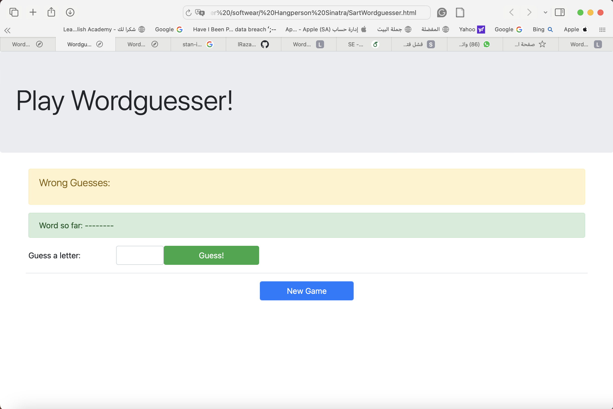

# 🕹️ SaaS Hangperson Game (Ruby + Sinatra)

This project is a simple **Hangman-style word guessing game** built using:
- Ruby language
- Sinatra web framework
- ERB views
- Bootstrap for UI
- Hosted locally via `rackup`

## 🎯 Objective
This was developed as a part of the SaaS course homework to practice:
- MVC architecture using Sinatra
- Session management in web apps
- ERB templating and route handling
- Ruby basics and OOP design

## 🧠 How the Game Works
- User starts a new game and guesses a secret word, one letter at a time.
- Valid and invalid guesses are tracked.
- Player wins by guessing all letters correctly before making 7 wrong guesses.
- The game handles user input errors and displays feedback messages.

## 📁 Key Files
- `app.rb` – Main Sinatra application
- `wordguesser_game.rb` – Game logic (model)
- `views/` – Contains all `.erb` view templates
- `public/shows/` – Game images for visual display

## 🚀 How to Run
```bash
rackup
# Then open http://localhost:9292 in your browser
```

## 📸 Preview


## 📎 GitHub Repo
🔗 [Click here to view the project on GitHub](https://github.com/dalal560/hw-sinatra-saas-hangperson)

---

**Created with ❤️ by Dalal Alwadei — Master of Computer Science**